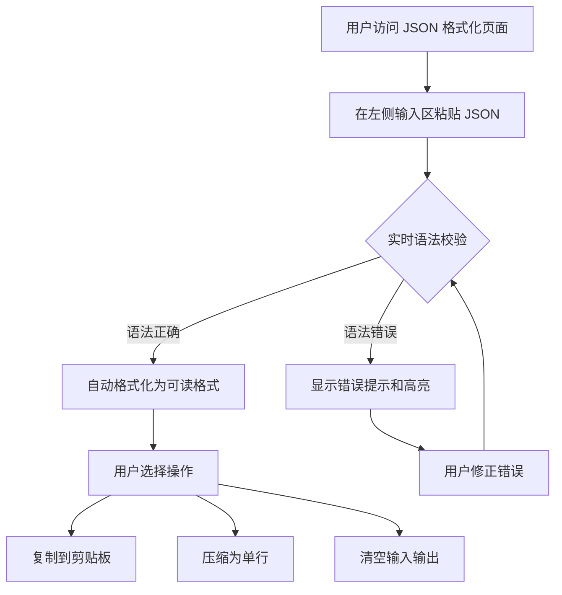
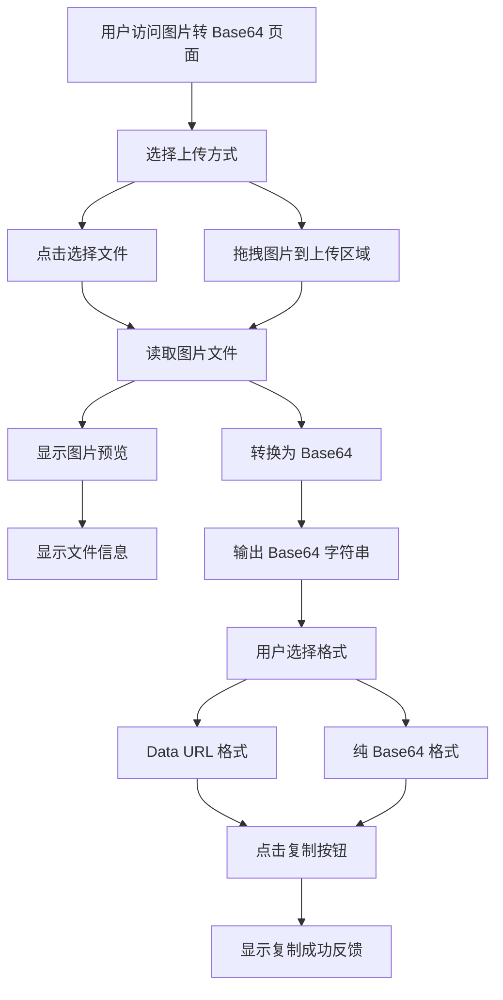
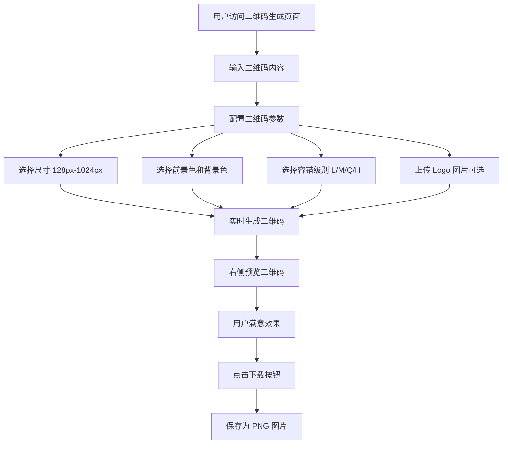

# 在线工具集合 - 产品需求文档 (PRD)

## 1. 产品概述

一个纯前端的在线工具集合网站，面向开发者和普通用户，提供 JSON 格式化、图片转 Base64、二维码生成等常用工具。所有数据处理均在浏览器端完成，无需后端服务，保障用户隐私。

- **主要目的**：提供开箱即用的在线开发工具，无需安装任何软件
- **解决的问题**：开发者日常需要频繁使用的格式转换、编码解码等工具
- **目标用户**：前端开发者、后端开发者、测试人员、设计师
- **市场价值**：便捷、安全、高效的工具集合，数据不上传服务器，隐私安全

## 2. 核心功能

### 2.1 用户角色

| 角色 | 注册方式 | 核心权限 |
|------|----------|----------|
| 普通用户 | 无需注册 | 浏览和使用所有工具功能 |

### 2.2 功能模块

1. **首页**：工具导航、工具卡片展示、粒子背景动画
2. **JSON 格式化工具**：JSON 格式化、压缩、校验、树形展示、转义/反转义
3. **图片转 Base64 工具**：图片上传、实时预览、Base64 输出、一键复制
4. **二维码生成工具**：内容输入、尺寸配置、颜色自定义、Logo 嵌入、下载导出

### 2.3 页面详情

| 页面名称 | 模块名称 | 功能描述 |
|----------|----------|----------|
| 首页 | Hero 区域 | 渐变发光标题、副标题、粒子背景动画 |
| 首页 | 工具卡片网格 | 展示所有可用工具，支持 hover 发光效果和点击跳转 |
| 首页 | 导航栏 | Logo、工具集标题、GitHub 链接、关于页面，移动端汉堡菜单 |
| JSON 格式化 | 输入区域 | 左侧文本框，支持粘贴 JSON 字符串 |
| JSON 格式化 | 输出区域 | 右侧文本框，显示格式化后的结果 |
| JSON 格式化 | 工具栏 | 格式化、压缩、复制、清空按钮 |
| JSON 格式化 | 错误提示 | 实时语法校验，错误高亮显示 |
| 图片转 Base64 | 上传区域 | 支持点击上传和拖拽上传，大面积拖放区域 |
| 图片转 Base64 | 图片预览 | 上传后即时显示原图预览 |
| 图片转 Base64 | 输出区域 | 显示 Data URL 或纯 Base64 字符串 |
| 图片转 Base64 | 文件信息 | 显示文件大小、尺寸、格式等信息 |
| 图片转 Base64 | 复制按钮 | 一键复制 Base64 字符串，复制成功后视觉反馈 |
| 二维码生成 | 配置面板 | 内容输入、尺寸选择、颜色配置、容错级别、Logo 上传 |
| 二维码生成 | 预览区域 | 实时预览生成的二维码 |
| 二维码生成 | 下载按钮 | 下载为 PNG 图片 |

## 3. 核心流程

### 3.1 用户使用流程

用户访问网站后，在首页浏览可用工具列表，点击感兴趣的工具卡片进入对应工具页面。在工具页面完成操作后，可以复制结果或下载文件。用户可以随时通过导航栏返回首页或切换到其他工具。

### 3.2 JSON 格式化流程

### 3.3 图片转 Base64 流程

### 3.4 二维码生成流程

## 4. 用户界面设计

### 4.1 设计风格

- **主色调**：深色背景 `#0a0a1a`，霓虹渐变高亮（蓝紫 `#7c3aed` → 青绿 `#06b6d4`）
- **辅助色**：毛玻璃效果 `rgba(255,255,255,0.05)`，边框辉光 `rgba(255,255,255,0.1)`
- **按钮样式**：发光按钮，使用 `box-shadow` 实现辉光效果，hover 时增强发光
- **字体**：系统字体栈 `-apple-system, BlinkMacSystemFont, 'Segoe UI', Roboto`
- **布局风格**：卡片式布局，毛玻璃容器，粒子背景动画
- **图标风格**：使用 SVG 图标，简洁现代

### 4.2 页面设计概览

| 页面名称 | 模块名称 | UI 元素 |
|----------|----------|---------|
| 首页 | 粒子背景 | 全屏粒子动画，蓝紫色系，80-100 个粒子，距离 < 150px 绘制连线，鼠标交互效果 |
| 首页 | Hero 区域 | 渐变文字标题（蓝紫→青绿），副标题淡入动画，居中布局 |
| 首页 | 工具卡片 | 毛玻璃容器，hover 向上浮动 8px + 边框发光，入场动画依次淡入（delay 递增 100ms） |
| 首页 | 导航栏 | 毛玻璃背景，固定顶部，Logo + 标题左侧，链接右侧，移动端汉堡菜单 |
| JSON 格式化 | 双栏布局 | 左右并排（桌面端），上下堆叠（移动端），暗色代码风格文本框 |
| JSON 格式化 | 工具栏 | 发光按钮组，格式化/压缩/复制/清空，按钮间距适中 |
| 图片转 Base64 | 上传区域 | 大面积拖放区域，虚线边框，拖拽时边框发光，点击上传提示 |
| 图片转 Base64 | 预览区域 | 左侧图片预览，右侧 Base64 输出，文件信息显示 |
| 二维码生成 | 配置面板 | 左侧配置项，输入框、选择器、颜色选择器、文件上传 |
| 二维码生成 | 预览区域 | 右侧实时预览，二维码居中显示，下载按钮 |

### 4.3 响应式设计

**桌面优先设计，移动端自适应**

| 断点 | 设备类型 | 布局策略 |
|------|----------|----------|
| < 768px | 手机 | 单列布局，工具卡片 1 列，导航栏汉堡菜单，粒子数量 30-40，关闭连线 |
| 768px - 1023px | 平板 | 双列布局，工具卡片 2 列，完整导航栏，粒子数量 50-70，开启连线 |
| >= 1024px | 桌面 | 三/四列布局，工具卡片 3-4 列，完整导航栏，粒子数量 80-100，开启连线 |

**移动端特殊处理**：
- 导航栏折叠为汉堡菜单，点击展开侧边抽屉
- 工具页面输入/输出区域改为上下堆叠
- 粒子效果自动降级，减少数量并关闭连线
- 所有可点击元素最小尺寸 44x44px（Apple HIG 标准）
- 拖拽上传区域在移动端增加点击上传的明显提示

### 4.4 动画效果

**粒子背景**：
- 使用 `tsparticles` 实现全屏粒子动画
- 粒子特性：2-5px 随机大小，蓝紫色系，透明度 0.3-0.7
- 连线效果：距离 < 150px 的粒子间绘制半透明连线
- 鼠标交互：鼠标附近粒子产生排斥/吸引效果
- 性能降级：移动端自动减少粒子数量，低性能设备关闭连线

**卡片交互**：
- 默认状态：半透明毛玻璃 + 微弱边框
- Hover 状态：边框发光 + 向上浮动 8px + 图标轻微旋转
- 入场动画：卡片依次从下方淡入（delay 递增 100ms）
- 点击效果：轻微缩放 + 路由过渡动画

**路由过渡**：
- 使用 Vue `<Transition>` 配合 `slide-fade` 效果
- 页面切换时平滑过渡

## 5. 后续扩展工具

| 工具名称 | 功能描述 | 优先级 |
|----------|----------|--------|
| 时间戳转换 | Unix 时间戳与日期互转 | 高 |
| URL 编解码 | URL 编码/解码 | 高 |
| MD5/SHA 哈希 | 文本和文件的哈希计算 | 中 |
| 颜色格式转换 | HEX / RGB / HSL 互转 | 中 |
| 正则表达式测试 | 正则匹配和替换测试 | 中 |
| 文本差异对比 | 两段文本的 diff 对比 | 低 |
| UUID 生成器 | 批量生成 UUID | 低 |
