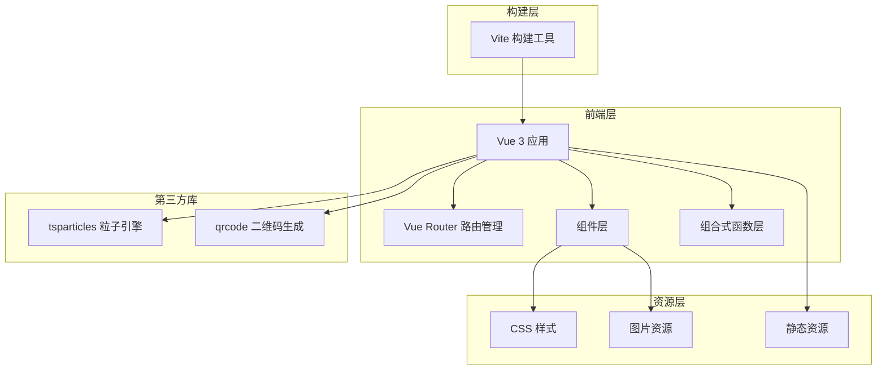

# 在线工具集合 - 技术架构文档

## 1. 架构设计



**架构说明**：
- 纯前端架构，无后端服务
- 所有数据处理在浏览器端完成
- 使用 Vue 3 Composition API 构建
- Vite 提供极速开发体验
- 第三方库通过 npm 管理

## 2. 技术描述

### 2.1 前端技术栈

| 技术 | 版本 | 用途 |
|------|------|------|
| Vue | 3.4+ | 前端框架，使用 Composition API |
| Vue Router | 4.2+ | SPA 路由管理 |
| Vite | 5.0+ | 构建工具，极速冷启动和热更新 |
| @vitejs/plugin-vue | 5.0+ | Vite 的 Vue 插件 |
| @tsparticles/vue3 | 3.0+ | Vue 3 粒子效果组件 |
| tsparticles | 3.0+ | 高性能粒子动画引擎 |
| qrcode | 1.5+ | 二维码生成库 |

### 2.2 样式方案

- **原生 CSS + CSS Variables**：不使用预处理器，保持轻量
- **CSS 变量**：统一管理主题色、间距、字体等
- **响应式断点**：
  - mobile: < 768px
  - tablet: 768px - 1023px
  - desktop: >= 1024px

### 2.3 初始化配置

```javascript
// vite.config.js
import { defineConfig } from 'vite'
import vue from '@vitejs/plugin-vue'

export default defineConfig({
  plugins: [vue()],
  base: './',  // GitHub Pages 部署需要相对路径
  build: {
    outDir: 'dist',
    assetsDir: 'assets'
  }
})
```

## 3. 路由定义

| 路由路径 | 组件名称 | 功能描述 |
|----------|----------|----------|
| `/` | Home.vue | 首页，展示工具列表和导航 |
| `/json-formatter` | JsonFormatter.vue | JSON 格式化工具页面 |
| `/image-to-base64` | ImageToBase64.vue | 图片转 Base64 工具页面 |
| `/qrcode-generator` | QrcodeGenerator.vue | 二维码生成工具页面 |

**路由配置**：
```javascript
// src/router/index.js
import { createRouter, createWebHashHistory } from 'vue-router'

const routes = [
  {
    path: '/',
    name: 'home',
    component: () => import('../views/Home.vue')
  },
  {
    path: '/json-formatter',
    name: 'json-formatter',
    component: () => import('../views/JsonFormatter.vue')
  },
  {
    path: '/image-to-base64',
    name: 'image-to-base64',
    component: () => import('../views/ImageToBase64.vue')
  },
  {
    path: '/qrcode-generator',
    name: 'qrcode-generator',
    component: () => import('../views/QrcodeGenerator.vue')
  }
]

const router = createRouter({
  history: createWebHashHistory(),
  routes
})

export default router
```

**路由懒加载**：所有工具页面使用 `() => import()` 按需加载，优化首屏加载速度。

**路由过渡动画**：使用 Vue `<Transition>` 配合 `slide-fade` 效果。

## 4. 目录结构

```
web/
├── public/                       # 静态资源（不经过构建处理）
│   └── favicon.ico
├── src/
│   ├── assets/                   # 项目资源（经过构建处理）
│   │   ├── styles/
│   │   │   ├── variables.css     # CSS 变量 / 主题色
│   │   │   ├── global.css        # 全局样式
│   │   │   └── animations.css    # 动画定义
│   │   └── images/               # 图标和图片
│   ├── components/               # 公共组件
│   │   ├── ParticlesBg.vue       # 粒子背景组件
│   │   ├── ToolCard.vue          # 工具卡片组件
│   │   ├── NavBar.vue            # 导航栏组件
│   │   └── GlassContainer.vue    # 毛玻璃容器组件
│   ├── composables/              # 组合式函数
│   │   ├── useClipboard.js       # 剪贴板操作
│   │   └── useResponsive.js      # 响应式检测
│   ├── views/                    # 页面视图
│   │   ├── Home.vue              # 首页
│   │   ├── JsonFormatter.vue     # JSON 格式化
│   │   ├── ImageToBase64.vue     # 图片转 Base64
│   │   └── QrcodeGenerator.vue   # 二维码生成
│   ├── router/
│   │   └── index.js              # 路由配置
│   ├── App.vue                   # 根组件
│   └── main.js                   # 入口文件
├── index.html
├── vite.config.js
├── package.json
└── DESIGN.md                     # 设计文档
```

## 5. 组件设计

### 5.1 公共组件

| 组件名称 | 职责 | 属性 |
|----------|------|------|
| ParticlesBg.vue | 粒子背景，全局复用 | 根据路由切换配置，根据设备类型调整粒子数量 |
| NavBar.vue | 顶部导航栏 | Logo、标题、导航链接、移动端汉堡菜单 |
| ToolCard.vue | 首页工具卡片 | icon、title、desc、path 属性 |
| GlassContainer.vue | 毛玻璃容器包装组件 | 默认插槽，应用毛玻璃效果 |

### 5.2 组合式函数

| 函数名称 | 职责 | 返回值 |
|----------|------|--------|
| useClipboard.js | 封装剪贴板写入和成功反馈 | `{ copied, copy }` |
| useResponsive.js | 检测当前断点，返回设备类型和粒子配置 | `{ windowWidth, deviceType, isMobile, isTablet, isDesktop }` |

## 6. 性能优化策略

| 策略 | 实现方式 | 说明 |
|------|----------|------|
| 路由懒加载 | `() => import(...)` | 工具页面按需加载，优化首屏 |
| 粒子降级 | 根据设备性能自动调整参数 | 移动端减少粒子数量，关闭连线 |
| 防抖/节流 | debounce、throttle | 输入类操作使用 debounce，滚动/resize 使用 throttle |
| 大文件处理 | FileReader 分块处理 | 图片转 Base64 大文件分块处理 |
| CSS 动画 | transform 和 opacity | 优先使用 GPU 加速的属性 |
| 代码分割 | Vite 自动优化 | 构建时自动进行代码分割 |

## 7. 部署方案

### 7.1 GitHub Pages 部署

```bash
# 构建命令
npm run build

# 输出目录
dist/

# 部署步骤
1. 运行 npm run build 生成 dist 目录
2. 将 dist 目录内容推送到 gh-pages 分支
3. 在 GitHub 仓库设置中启用 GitHub Pages
4. 选择 gh-pages 分支作为源
```

### 7.2 Vite 配置

```javascript
// vite.config.js
export default defineConfig({
  base: './',  // 使用相对路径，适配 GitHub Pages 的子路径部署
  build: {
    outDir: 'dist',
    assetsDir: 'assets',
    rollupOptions: {
      output: {
        manualChunks: {
          'vue-vendor': ['vue', 'vue-router'],
          'particles': ['tsparticles', '@tsparticles/vue3']
        }
      }
    }
  }
})
```

## 8. 开发计划

### 第一阶段：项目搭建（已完成）

- [x] 编写设计文档
- [x] 初始化 Vue3 + Vite 项目
- [x] 配置路由和目录结构
- [ ] 实现全局样式（深色主题、CSS 变量）
- [ ] 实现粒子背景组件
- [ ] 实现导航栏组件（含响应式）
- [ ] 实现首页布局和卡片

### 第二阶段：核心工具

- [ ] 实现 JSON 格式化工具
- [ ] 实现图片转 Base64 工具
- [ ] 实现二维码生成工具

### 第三阶段：优化与扩展

- [ ] 完善动画和交互细节
- [ ] 添加更多工具（时间戳转换、URL 编解码等）
- [ ] 移动端适配测试和优化
- [ ] 部署到 GitHub Pages
