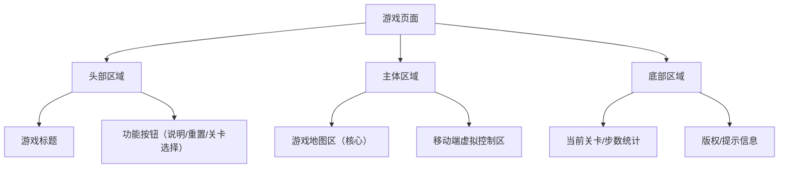

# 推箱子游戏实现说明文档
## 文档信息
| 项目         | 内容                                   |
|--------------|----------------------------------------|
| 文档版本     | V1.0                                   |
| 编写日期     | 2026-01-20                             |
| 适用范围     | 基于JavaScript+HTML的推箱子游戏开发    |
| 开发语言/工具 | HTML5、CSS3、原生JavaScript、VS Code   |

## 1. 游戏概述
### 1.1 基本定义
推箱子（Sokoban）是一款经典的益智类单机游戏，起源于1980年代的日本。本版本基于Web技术实现，保留经典玩法的同时适配现代多终端设备，无需安装，通过浏览器即可运行。

### 1.2 核心玩法
玩家通过操控游戏内的角色（以下简称“玩家角色”），在封闭的二维网格地图中，将指定数量的箱子推到预设的目标点位上。核心操作逻辑为：
- 玩家角色仅能在空白格子、目标点格子上移动，无法穿过墙体；
- 玩家角色可向上下左右四个方向移动，推动前方的单个箱子（仅能“推”，无法“拉”箱子）；
- 箱子仅能被推到空白格子或目标点格子上，无法穿过墙体、其他箱子；
- 所有箱子到达目标点后，当前关卡通关，可进入下一关。

### 1.3 游戏目标
- 核心目标：完成当前关卡的箱子归位，解锁并通关所有预设关卡；
- 体验目标：操作流畅、反馈及时，适配不同设备（PC/移动端），提供清晰的游戏指引；
- 技术目标：无第三方引擎依赖，代码轻量化，加载速度快，兼容主流浏览器。

### 1.4 核心机制
| 机制名称       | 详细说明                                                                 |
|----------------|--------------------------------------------------------------------------|
| 网格地图机制   | 游戏地图由“网格”构成，每个网格单元为独立的交互单位（墙/空地/目标点/箱子/玩家） |
| 碰撞检测机制   | 实时检测玩家移动路径上的元素（墙/箱子），判断移动/推动是否合法             |
| 状态判定机制   | 实时检测所有箱子的位置，判断是否满足通关条件                             |
| 关卡进度机制   | 记录已通关关卡，支持关卡选择、重新开始当前关卡                           |

## 2. 功能需求
### 2.1 核心功能清单
| 功能模块               | 子功能                                                                 | 优先级 |
|------------------------|------------------------------------------------------------------------|--------|
| 游戏地图加载与显示     | 1. 解析网格格式的地图数据<br>2. 渲染地图元素（墙、空地、目标点、箱子、玩家）<br>3. 适配不同屏幕的地图缩放 | 高     |
| 玩家角色移动控制       | 1. 支持方向键（PC端）、虚拟方向按键（移动端）控制<br>2. 移动前碰撞检测<br>3. 移动动画反馈 | 高     |
| 箱子推动逻辑           | 1. 仅当箱子前方无阻挡时可推动<br>2. 箱子推到目标点后视觉状态变化<br>3. 禁止推动多个箱子叠加 | 高     |
| 关卡设计与切换系统     | 1. 预设多难度梯度关卡（至少10关）<br>2. 关卡选择界面展示已解锁/未解锁关卡<br>3. 通关后自动/手动切换下一关 | 中     |
| 游戏状态保存与重置     | 1. 本地存储（localStorage）已通关关卡进度<br>2. 支持当前关卡重置（保留进度）<br>3. 可选清除所有进度 | 中     |
| 胜利条件判断机制       | 1. 实时检测所有箱子是否位于目标点<br>2. 通关后显示提示文案+动画<br>3. 解锁下一关入口 | 高     |
| 辅助功能               | 1. 操作说明弹窗<br>2. 移动步数统计<br>3. 游戏背景音乐/音效开关（可选） | 低     |

### 2.2 关键功能详细说明
#### 2.2.1 游戏地图加载与显示
- 地图数据格式：采用二维数组存储，示例：
  ```javascript
  // 0=空地 1=墙 2=玩家 3=箱子 4=目标点 5=箱子在目标点 6=玩家在目标点
  const level1 = [
    [1,1,1,1,1],
    [1,0,0,0,1],
    [1,0,3,0,1],
    [1,2,0,4,1],
    [1,1,1,1,1]
  ];
  ```
- 渲染方式：DOM渲染（优先），通过div元素拼接网格，每个网格单元设置统一尺寸（如40px×40px），通过CSS类名区分元素类型。

#### 2.2.2 箱子推动逻辑
核心判定逻辑伪代码：
```
当玩家按下方向键（如向右）：
1. 获取玩家当前坐标 (x, y)
2. 计算玩家移动后的目标坐标 (x, y+1)
3. 检测目标坐标元素类型：
   - 若为墙（1）：禁止移动
   - 若为空地（0）/目标点（4）：玩家移动到目标坐标
   - 若为箱子（3）/箱子在目标点（5）：
     a. 计算箱子移动后的坐标 (x, y+2)
     b. 检测箱子目标坐标：
        - 若为墙（1）/箱子（3）/箱子在目标点（5）：禁止推动，玩家不移动
        - 若为空地（0）/目标点（4）：玩家移动到 (x, y+1)，箱子移动到 (x, y+2)，更新对应坐标的元素类型
```

#### 2.2.3 胜利条件判断
- 遍历地图数组，统计“箱子”（3）的数量：
  - 若数量为0 → 所有箱子已在目标点 → 触发通关逻辑；
  - 若数量>0 → 未通关，继续游戏。

## 3. 技术规格
### 3.1 开发技术栈
| 技术领域       | 具体选型                                                                 | 选型理由                     |
|----------------|--------------------------------------------------------------------------|------------------------------|
| 界面结构       | HTML5 语义化标签（header/main/footer）                                  | 兼容性好，结构清晰           |
| 样式与布局     | CSS3（Flex/Grid布局、Media Query、CSS动画）                             | 实现响应式，无需第三方框架   |
| 游戏逻辑       | 原生JavaScript（ES6+）                                                  | 无依赖，轻量化，易维护       |
| 数据存储       | localStorage                                                             | 本地持久化，无需后端支持     |
| 渲染方式       | DOM渲染（优先）/Canvas渲染（备选）                                       | DOM渲染开发成本低，调试方便  |

### 3.2 兼容性要求
| 终端类型 | 兼容范围                                  | 核心要求                                  |
|----------|-------------------------------------------|-------------------------------------------|
| PC端     | Chrome ≥ 60、Firefox ≥ 55、Edge ≥ 79      | 方向键控制正常，地图渲染无变形            |
| 移动端   | 主流手机浏览器（微信/QQ/Chrome移动端）    | 虚拟按键可点击，地图适配屏幕宽度          |

### 3.3 性能要求
- 加载性能：首次加载时间 ≤ 2s（无网络资源依赖）；
- 运行性能：玩家移动/推箱子操作无卡顿，帧率 ≥ 60fps；
- 资源占用：内存占用 ≤ 50MB，无内存泄漏。

### 3.4 代码规范
- 遵循ESLint基础规范（no-var、缩进2空格等）；
- 代码模块化：按功能拆分文件（map.js/player.js/level.js等）；
- 注释要求：核心函数、复杂逻辑必须添加注释，关键变量注明用途。

## 4. 界面设计
### 4.1 整体布局
采用响应式布局，适配PC/移动端，核心布局如下（Mermaid流程图展示）：

**布局示意图（文字版）**：
```
┌─────────────────────────────────────┐
│ 推箱子游戏      说明 | 重置 | 关卡选择 │ 头部区域
├─────────────────────────────────────┤
│                                     │
│              游戏地图区              │ 主体区域
│                                     │
│  [↑]                                │
│ [←] [↓] [→]   关卡：1/10 步数：12   │ 移动端控制+信息
├─────────────────────────────────────┤
│ 温馨提示：方向键控制移动，推所有箱子到目标点通关 │ 底部区域
└─────────────────────────────────────┘
```

### 4.2 视觉设计
#### 4.2.1 元素样式（像素风，简约易识别）
| 元素类型 | 样式描述                          | CSS类名  |
|----------|-----------------------------------|----------|
| 墙       | 深灰色背景，边框加粗              | .wall    |
| 空地     | 浅灰色背景                        | .empty   |
| 目标点   | 浅灰色背景+黄色圆形标记           | .target  |
| 玩家     | 蓝色方块（带简单人形图标）        | .player  |
| 箱子     | 棕色方块，边角圆润                | .box     |
| 箱子在目标点 | 棕色方块+黄色圆形标记           | .box-on-target |

#### 4.2.2 交互反馈
- 玩家移动：添加0.1s的位移过渡动画；
- 箱子推动：添加轻微的缩放动画（推时缩小10%，到位后恢复）；
- 通关提示：屏幕中央弹出通关弹窗，包含“下一关”“重玩”按钮，背景半透明遮罩；
- 操作错误（如撞墙）：无动画反馈，仅不执行操作（避免干扰体验）。

### 4.3 核心界面详情
#### 4.3.1 游戏主界面
- 地图区：宽度自适应（最大600px），居中显示，网格单元尺寸根据屏幕宽度自动调整（最小30px，最大50px）；
- 虚拟控制区（仅移动端显示）：4个方向按键，每个按键尺寸60px×60px，布局为十字形；
- 功能按钮：按钮尺寸统一（80px×30px），hover/点击状态有颜色变化。

#### 4.3.2 关卡选择界面
- 弹窗形式，背景半透明遮罩；
- 关卡列表：按网格排列（PC端5列，移动端3列）；
- 关卡项：显示关卡编号，已通关关卡标绿色对勾，未通关标灰色锁图标；
- 操作：点击已解锁关卡直接进入，点击关闭按钮返回当前游戏。

#### 4.3.3 操作说明界面
- 弹窗形式，包含：
  1. 操作方式（PC端方向键、移动端虚拟按键）；
  2. 元素说明（图文展示墙/箱子/目标点）；
  3. 核心规则（仅能推箱子、禁止推多个箱子）；
  4. 关闭按钮。

## 5. 实现步骤
### 阶段1：环境搭建与基础结构
1. 创建项目目录结构：
   ```
   sokoban/
   ├── index.html       // 主页面
   ├── css/
   │   └── style.css    // 样式文件
   ├── js/
   │   ├── main.js      // 入口文件
   │   ├── map.js       // 地图加载/渲染
   │   ├── player.js    // 玩家控制/碰撞检测
   │   ├── level.js     // 关卡管理
   │   └── storage.js   // 本地存储
   └── assets/          // 可选：音效/图标资源
   ```
2. 编写HTML基础结构，引入CSS/JS文件；
3. 实现基础样式（布局、元素样式、响应式适配）。

### 阶段2：核心逻辑开发
1. 地图模块：
   - 定义地图数据格式，编写基础地图渲染函数；
   - 实现地图元素的动态更新（玩家/箱子移动后刷新）。
2. 玩家控制模块：
   - 监听键盘方向键事件（PC端）；
   - 编写碰撞检测函数，判断移动是否合法；
   - 实现玩家移动的DOM更新逻辑。
3. 箱子推动模块：
   - 基于玩家移动逻辑，扩展箱子推动的判定与更新；
   - 处理箱子在目标点的状态切换。
4. 胜利判定模块：
   - 编写通关检测函数，实时监听箱子位置；
   - 实现通关提示弹窗与下一关解锁逻辑。

### 阶段3：关卡与存储功能
1. 关卡模块：
   - 预设多关卡数据（至少10关，难度递增）；
   - 实现关卡选择弹窗、关卡切换逻辑。
2. 存储模块：
   - 封装localStorage操作函数（保存/读取/清除进度）；
   - 关联关卡解锁状态与本地存储。

### 阶段4：界面优化与辅助功能
1. 交互优化：
   - 添加移动/推动动画；
   - 实现移动端虚拟按键控制；
   - 完善弹窗（说明/关卡选择/通关）的样式与交互。
2. 辅助功能：
   - 实现步数统计；
   - 可选：添加背景音乐/音效开关。

### 阶段5：测试与修复
1. 功能测试：按测试标准验证所有功能；
2. 兼容性测试：在不同浏览器/设备上验证；
3. 性能优化：修复卡顿、样式错位等问题；
4. 文档完善：补充代码注释、测试报告。

## 6. 测试标准及验收条件
### 6.1 功能测试标准
| 测试项               | 测试方法                                                                 | 合格标准                                   |
|----------------------|--------------------------------------------------------------------------|--------------------------------------------|
| 地图加载             | 加载不同关卡，检查地图元素渲染是否正确                                   | 所有元素（墙/箱子/目标点）位置、样式正确    |
| 玩家移动             | 按方向键/点击虚拟按键，尝试向各方向移动                                   | 仅能在合法区域移动，无穿墙/穿箱子现象       |
| 箱子推动             | 尝试推动箱子到空地/目标点，尝试推多个箱子/推墙                            | 仅能推动单个箱子到合法区域，非法操作无响应  |
| 通关判定             | 将所有箱子推到目标点                                                     | 立即触发通关提示，解锁下一关               |
| 关卡切换             | 通关后点击下一关，关卡选择界面点击不同关卡                               | 正确切换地图，保留当前关卡进度             |
| 进度存储             | 通关某关卡后刷新页面/清除缓存                                             | 刷新后进度保留，清除后进度重置             |
| 关卡重置             | 点击重置按钮                                                             | 当前关卡恢复初始状态，总进度不变           |

### 6.2 兼容性测试标准
| 测试维度       | 测试对象                          | 合格标准                                   |
|----------------|-----------------------------------|--------------------------------------------|
| 浏览器兼容     | Chrome/Firefox/Edge（PC）；微信/Chrome（移动端） | 界面无变形，操作无卡顿，功能全部可用       |
| 屏幕适配       | PC（1920×1080）、手机（375×667）、平板（768×1024） | 地图居中显示，移动端虚拟按键正常显示       |
| 操作适配       | PC（键盘）、移动端（触摸）        | 控制方式匹配终端类型，操作响应延迟 < 100ms |

### 6.3 性能测试标准
| 测试项         | 测试工具/方法                     | 合格标准                                   |
|----------------|-----------------------------------|--------------------------------------------|
| 加载速度       | 浏览器Network面板（禁用缓存）     | 首次加载时间 ≤ 2s，无资源加载失败          |
| 运行帧率       | 浏览器Performance面板             | 平均帧率 ≥ 60fps，无明显掉帧               |
| 内存占用       | 浏览器Memory面板                  | 运行过程中内存占用稳定，无持续增长         |

### 6.4 验收条件
1. 功能完整性：所有核心功能（移动/推箱子/关卡/存储）均实现且符合测试标准；
2. 交互体验：操作流畅，反馈及时，无卡顿/错位/误操作；
3. 兼容性：通过所有预设的浏览器/设备兼容性测试；
4. 代码规范：代码模块化，核心逻辑有注释，无语法错误；
5. 文档完整性：实现说明文档与代码注释一致，可指导后续维护。

## 7. 异常处理与边界情况
| 边界情况               | 处理方案                                                                 |
|------------------------|--------------------------------------------------------------------------|
| 玩家试图推多个箱子     | 禁止移动，无反馈（避免干扰）                                             |
| 箱子被推到地图边界     | 碰撞检测拦截，禁止推动                                                   |
| 移动端屏幕旋转         | 监听屏幕旋转事件，重新计算地图尺寸，保持居中显示                         |
| localStorage存储失败   | 提示“无法保存进度”，不影响游戏运行（仅丢失进度）                         |
| 关卡数据错误（如玩家在墙外） | 加载关卡时校验数据，自动重置为默认关卡                                   |

## 8. 扩展功能建议（可选）
1. 难度自定义：允许玩家自定义地图尺寸、箱子数量；
2. 步数排行：记录各关卡最少通关步数，本地存储排行数据；
3. 皮肤切换：支持玩家/箱子/墙的样式切换；
4. 提示功能：卡关时提供一步提示（消耗次数）。

### 总结
1. 本文档明确了推箱子游戏的核心玩法、功能需求和技术实现标准，采用原生JS+HTML实现，无第三方引擎依赖，适配多终端；
2. 开发流程分5个阶段，从环境搭建到测试验收，每个阶段有明确的任务目标，核心逻辑（如箱子推动、通关判定）提供了具体的实现思路；
3. 测试标准覆盖功能、兼容性、性能三个维度，验收条件明确，可作为开发和验收的核心依据。