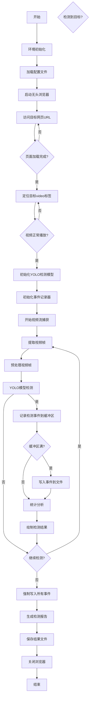

# 视频检测事件记录功能设计计划

## 目标

将视频中检测到的人物和车辆事件准确记录到文件中，便于后续分析和查看。

## 1. 事件记录格式设计

### 1.1 文件格式选择

| 格式 | 优点 | 缺点 | 适用场景 |
|------|------|------|----------|
| **JSON** | 结构清晰，支持嵌套数据，易于机器解析 | 文件体积较大，可读性一般 | 复杂事件数据，需要保留完整结构 |
| **CSV** | 体积小，可读性强，易于Excel打开 | 不支持嵌套数据，类型信息丢失 | 简单事件数据，需要频繁人工查看 |
| **Parquet** | 压缩率高，查询效率高 | 需要特定库读取 | 大数据量，后续需要复杂查询分析 |

**推荐方案**：同时支持JSON和CSV格式，JSON用于完整记录，CSV用于快速查看

### 1.2 事件数据结构

```json
{
  "event_id": "uuid-123456",
  "timestamp": "2023-10-01T12:00:00.123Z",
  "frame_number": 123,
  "object_type": "person",
  "confidence": 0.95,
  "bbox": {
    "x1": 100,
    "y1": 200,
    "x2": 150,
    "y2": 280
  },
  "center": {
    "x": 125,
    "y": 240
  },
  "video_info": {
    "url": "https://example.com/video",
    "video_id": "target-video",
    "frame_rate": 30,
    "resolution": "1920x1080"
  },
  "detection_info": {
    "model": "yolov8n",
    "confidence_threshold": 0.5
  }
}
```

### 1.3 CSV格式字段

| 字段名 | 数据类型 | 说明 |
|--------|----------|------|
| event_id | 字符串 | 事件唯一标识符 |
| timestamp | 字符串 | 事件发生时间 |
| frame_number | 整数 | 视频帧编号 |
| object_type | 字符串 | 目标类型（person/car/truck等） |
| confidence | 浮点数 | 检测置信度 |
| bbox_x1 | 整数 | 边界框左上角x坐标 |
| bbox_y1 | 整数 | 边界框左上角y坐标 |
| bbox_x2 | 整数 | 边界框右下角x坐标 |
| bbox_y2 | 整数 | 边界框右下角y坐标 |

## 2. 实现方法

### 2.1 实时记录 vs 批量记录

| 方式 | 优点 | 缺点 | 实现方式 |
|------|------|------|----------|
| **实时记录** | 数据安全，不会丢失 | IO开销大 | 每次检测到事件立即写入文件 |
| **批量记录** | IO开销小，性能好 | 程序崩溃可能丢失数据 | 累计一定数量事件后批量写入 |

**推荐方案**：采用混合模式
- 内存中缓存100-500个事件
- 每5秒或达到缓存上限时写入一次
- 程序结束时强制写入所有缓存

### 2.2 代码实现示例

```python
import json
import csv
import uuid
from datetime import datetime
from pathlib import Path

class EventRecorder:
    def __init__(self, output_dir, video_info, detection_info):
        self.output_dir = Path(output_dir)
        self.output_dir.mkdir(exist_ok=True)
        self.video_info = video_info
        self.detection_info = detection_info
        self.event_buffer = []
        self.buffer_size = 200
        self.json_path = self.output_dir / "events.json"
        self.csv_path = self.output_dir / "events.csv"
        self._init_files()
    
    def _init_files(self):
        # 初始化JSON文件
        with open(self.json_path, 'w') as f:
            json.dump([], f)
        
        # 初始化CSV文件
        with open(self.csv_path, 'w', newline='') as f:
            writer = csv.writer(f)
            writer.writerow([
                "event_id", "timestamp", "frame_number", "object_type",
                "confidence", "bbox_x1", "bbox_y1", "bbox_x2", "bbox_y2"
            ])
    
    def record_event(self, frame_number, object_type, confidence, bbox):
        # 创建事件数据
        event = {
            "event_id": str(uuid.uuid4()),
            "timestamp": datetime.now().isoformat() + "Z",
            "frame_number": frame_number,
            "object_type": object_type,
            "confidence": confidence,
            "bbox": {
                "x1": bbox[0],
                "y1": bbox[1],
                "x2": bbox[2],
                "y2": bbox[3]
            },
            "center": {
                "x": (bbox[0] + bbox[2]) / 2,
                "y": (bbox[1] + bbox[3]) / 2
            },
            "video_info": self.video_info,
            "detection_info": self.detection_info
        }
        
        # 添加到缓冲区
        self.event_buffer.append(event)
        
        # 检查是否需要写入文件
        if len(self.event_buffer) >= self.buffer_size:
            self._write_events()
    
    def _write_events(self):
        if not self.event_buffer:
            return
        
        # 写入JSON文件
        with open(self.json_path, 'r+') as f:
            existing_events = json.load(f)
            existing_events.extend(self.event_buffer)
            f.seek(0)
            json.dump(existing_events, f, indent=2)
            f.truncate()
        
        # 写入CSV文件
        with open(self.csv_path, 'a', newline='') as f:
            writer = csv.writer(f)
            for event in self.event_buffer:
                writer.writerow([
                    event["event_id"],
                    event["timestamp"],
                    event["frame_number"],
                    event["object_type"],
                    event["confidence"],
                    event["bbox"]["x1"],
                    event["bbox"]["y1"],
                    event["bbox"]["x2"],
                    event["bbox"]["y2"]
                ])
        
        # 清空缓冲区
        self.event_buffer.clear()
    
    def flush(self):
        """强制写入所有缓存事件"""
        self._write_events()
```

## 3. 集成到主流程

### 3.1 修改设计流程图



### 3.2 集成要点

* 在初始化YOLO模型后，创建EventRecorder实例
* 检测到目标时调用record_event方法
* 定期检查缓冲区，满则写入文件
* 程序结束前调用flush方法，确保所有事件都被写入
* 支持同时记录到多个文件格式

## 4. 结果文件管理

### 4.1 文件名命名规范

```
{timestamp}_{video_id}_events.json
{timestamp}_{video_id}_events.csv
```

示例：`20231001_120000_example_com_video_events.json`

### 4.2 目录结构

```
results/
├── 20231001_120000_example_com_video/
│   ├── events.json          # 完整事件记录
│   ├── events.csv           # 简化事件记录
│   ├── detection_video.mp4  # 带检测框的视频（可选）
│   └── report.txt           # 检测统计报告
└── ...
```

## 5. 性能优化

* **缓冲区大小调整**：根据视频长度和检测频率调整缓冲区大小
* **异步写入**：使用线程或异步IO进行文件写入，避免阻塞检测流程
* **压缩存储**：对于长期存储，可以考虑压缩JSON文件
* **索引优化**：为常用查询字段（如时间戳、目标类型）创建索引

## 6. 后续扩展

* 支持数据库存储（如SQLite、MongoDB）
* 添加事件关联功能（跟踪同一目标的连续事件）
* 实现事件检索API
* 支持实时事件推送

这个计划详细设计了事件记录功能，确保所有检测事件都能准确、高效地记录到文件中，便于后续分析和查看~ 😊