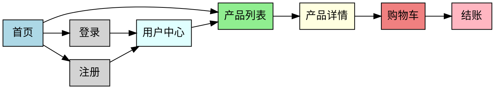

# 购物网站链接关系图分析方案

## 一、方案概述

本方案旨在分析商品购物网站的网页链接关系，特别关注购买流程、注册登录页面之间的关联，最终生成可视化的链接关系图。

## 二、实施步骤

### 1. 网站抓取与内容获取

#### （1）工具选择
- **动态网站**：使用 Puppeteer（Node.js 库）模拟浏览器行为，抓取渲染后的页面
- **静态网站**：使用 wget 或 httrack 进行递归抓取

#### （2）抓取策略
```bash
# 使用 Puppeteer 抓取页面（示例代码）
const puppeteer = require('puppeteer');

async function crawlWebsite(startUrl) {
  const browser = await puppeteer.launch();
  const page = await browser.newPage();
  
  // 设置请求头
  await page.setUserAgent('Mozilla/5.0 (Windows NT 10.0; Win64; x64) AppleWebKit/537.36 (KHTML, like Gecko) Chrome/91.0.4472.124 Safari/537.36');
  
  // 访问起始页面
  await page.goto(startUrl, { waitUntil: 'networkidle2' });
  
  // 获取页面内容
  const html = await page.content();
  
  // 提取链接
  const links = await page.evaluate(() => {
    const anchorTags = document.querySelectorAll('a[href]');
    return Array.from(anchorTags).map(a => a.href);
  });
  
  await browser.close();
  return { html, links };
}
```

### 2. 链接提取与过滤

#### （1）提取所有链接
- 从 HTML 中提取 `<a>` 标签的 `href` 属性
- 从 CSS 和 JS 文件中提取资源链接
- 处理相对链接，转换为绝对链接

#### （2）过滤有效链接
- 保留同一域名下的链接
- 过滤重复链接
- 排除无效链接（如 `javascript:void(0)`）
- 重点关注：
  - 产品列表页
  - 产品详情页
  - 购物车页面
  - 结账流程页面
  - 注册/登录页面
  - 用户中心页面

### 3. 链接关系分析

#### （1）构建链接关系数据
```javascript
// 示例数据结构
const linkRelations = {
  "source": "https://example.com/home",
  "targets": [
    "https://example.com/products",
    "https://example.com/login",
    "https://example.com/register"
  ]
};
```

#### （2）识别关键页面关系
- **首页 → 产品列表页 → 产品详情页 → 购物车 → 结账 → 订单确认**
- **首页 → 登录/注册 → 用户中心**
- **产品详情页 → 相关产品 → 产品详情页**

#### （3）分析页面层级
- 一级页面：首页、产品分类
- 二级页面：产品列表、登录/注册
- 三级页面：产品详情、购物车
- 四级页面：结账流程、订单确认

### 4. 关系图可视化

#### （1）工具选择
- **Graphviz**：开源图形可视化软件，使用 DOT 语言描述图形
- **D3.js**：JavaScript 库，用于创建交互式数据可视化
- **在线工具**：Draw.io、Lucidchart 等

#### （2）使用 Graphviz 生成关系图

**安装 Graphviz**：
```bash
# macOS
brew install graphviz
# Ubuntu/Debian
sudo apt-get install graphviz
```

**生成 DOT 文件**（示例）：


**生成关系图**：
```bash
dot -Tpng website-links.dot -o website-links.png
```

#### （3）交互式可视化（使用 D3.js）

创建 HTML 文件，使用 D3.js 绘制交互式关系图：
```html
<!DOCTYPE html>
<html lang="zh-CN">
<head>
    <meta charset="UTF-8">
    <title>网站链接关系图</title>
    <script src="https://d3js.org/d3.v7.min.js"></script>
    <style>
        .node {
            stroke: #fff;
            stroke-width: 1.5px;
        }
        .link {
            stroke: #999;
            stroke-opacity: 0.6;
        }
        .node-label {
            font-size: 10px;
            text-anchor: middle;
        }
    </style>
</head>
<body>
    <svg width="800" height="600"></svg>
    <script>
        // 示例数据
        const data = {
            nodes: [
                {id: "home", name: "首页"},
                {id: "products", name: "产品列表"},
                {id: "product-detail", name: "产品详情"},
                {id: "cart", name: "购物车"},
                {id: "checkout", name: "结账"},
                {id: "login", name: "登录"},
                {id: "register", name: "注册"},
                {id: "user-center", name: "用户中心"}
            ],
            links: [
                {source: "home", target: "products"},
                {source: "home", target: "login"},
                {source: "home", target: "register"},
                {source: "products", target: "product-detail"},
                {source: "product-detail", target: "cart"},
                {source: "cart", target: "checkout"},
                {source: "login", target: "user-center"},
                {source: "register", target: "user-center"},
                {source: "user-center", target: "products"}
            ]
        };
        
        const svg = d3.select("svg");
        const width = +svg.attr("width");
        const height = +svg.attr("height");
        
        const simulation = d3.forceSimulation(data.nodes)
            .force("link", d3.forceLink(data.links).id(d => d.id).distance(100))
            .force("charge", d3.forceManyBody().strength(-300))
            .force("center", d3.forceCenter(width / 2, height / 2));
        
        const link = svg.append("g")
            .selectAll("line")
            .data(data.links)
            .enter().append("line")
            .attr("class", "link");
        
        const node = svg.append("g")
            .selectAll("circle")
            .data(data.nodes)
            .enter().append("circle")
            .attr("class", "node")
            .attr("r", 20)
            .style("fill", "lightblue")
            .call(d3.drag()
                .on("start", dragstarted)
                .on("drag", dragged)
                .on("end", dragended));
        
        const labels = svg.append("g")
            .selectAll("text")
            .data(data.nodes)
            .enter().append("text")
            .attr("class", "node-label")
            .text(d => d.name);
        
        simulation.on("tick", () => {
            link
                .attr("x1", d => d.source.x)
                .attr("y1", d => d.source.y)
                .attr("x2", d => d.target.x)
                .attr("y2", d => d.target.y);
            
            node
                .attr("cx", d => d.x)
                .attr("cy", d => d.y);
            
            labels
                .attr("x", d => d.x)
                .attr("y", d => d.y + 5);
        });
        
        function dragstarted(event, d) {
            if (!event.active) simulation.alphaTarget(0.3).restart();
            d.fx = d.x;
            d.fy = d.y;
        }
        
        function dragged(event, d) {
            d.fx = event.x;
            d.fy = event.y;
        }
        
        function dragended(event, d) {
            if (!event.active) simulation.alphaTarget(0);
            d.fx = null;
            d.fy = null;
        }
    </script>
</body>
</html>
```

### 5. 分析报告生成

#### （1）关键发现
- 网站的主要导航结构
- 购买流程的完整路径
- 注册登录系统的入口和流程
- 页面之间的跳转关系

#### （2）优化建议
- 简化购买流程，减少页面跳转
- 优化登录/注册流程，支持社交登录
- 加强相关产品推荐，提高转化率
- 优化移动端导航，提升用户体验

## 三、预期成果

1. **完整的链接关系数据**：包含所有页面之间的链接关系
2. **可视化关系图**：静态图片和交互式网页两种形式
3. **页面层级分析**：清晰的页面结构和层级关系
4. **关键流程梳理**：完整的购买流程和用户注册流程
5. **优化建议**：基于链接关系的网站优化建议

## 四、实施注意事项

1. **遵守网站规则**：尊重 robots.txt 协议，避免过度抓取
2. **保护用户隐私**：不抓取敏感信息，如用户数据、订单信息等
3. **合法使用数据**：仅用于分析和二次开发，不用于商业用途
4. **注意版权问题**：尊重网站内容的版权，合理使用抓取的数据

## 五、后续工作

1. 根据关系图分析，优化网站结构
2. 针对关键流程，进行用户体验优化
3. 建立网站地图，提高 SEO 效果
4. 定期更新链接关系图，适应网站变化

这个方案将帮助您全面了解购物网站的链接关系，为后续的二次开发和优化提供有力支持。